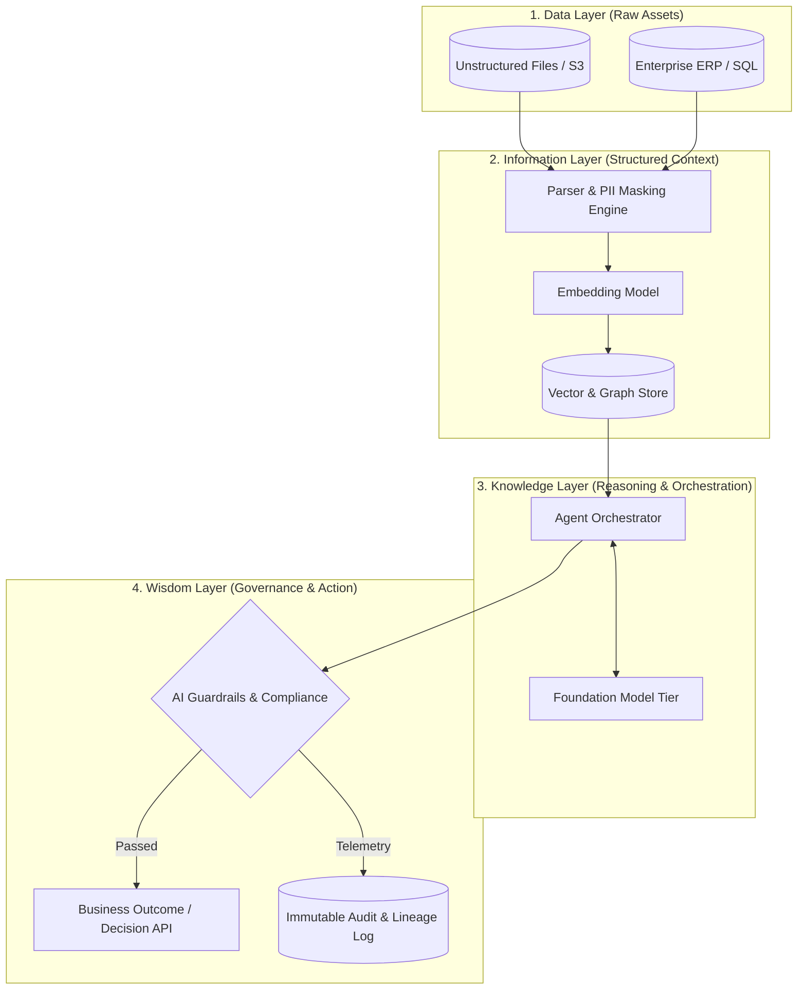

# AI Architecture Planning & Diagramming Skill

## Core Directives
1. **DIKW Architecture Mapping**: Clearly delineate how data moves through the architecture:
   - *Data Layer*: Source systems, document stores, raw event queues.
   - *Information Layer*: ETL, chunking, embedding generation, vector indices.
   - *Knowledge Layer*: Context routing, semantic caching, agentic orchestration, RAG retrieval.
   - *Wisdom Layer*: Guardrail enforcement, human-in-the-loop feedback, business logic integration.

2. **Tri-Governance Technical Controls**:
   - *Data Governance*: Integration with data catalogs, PII anonymization, lineage tracking.
   - *AI Governance*: Guardrail filters (LlamaGuard, NeMo), hallucination evaluators (Ragas, TruLens), model audit logs.
   - *Corporate Governance*: Zero-data retention agreements, tenant isolation, disaster recovery.

3. **Mermaid Diagram Standards**:
Always produce clear Mermaid diagrams showing data flow and governance checkpoints:

