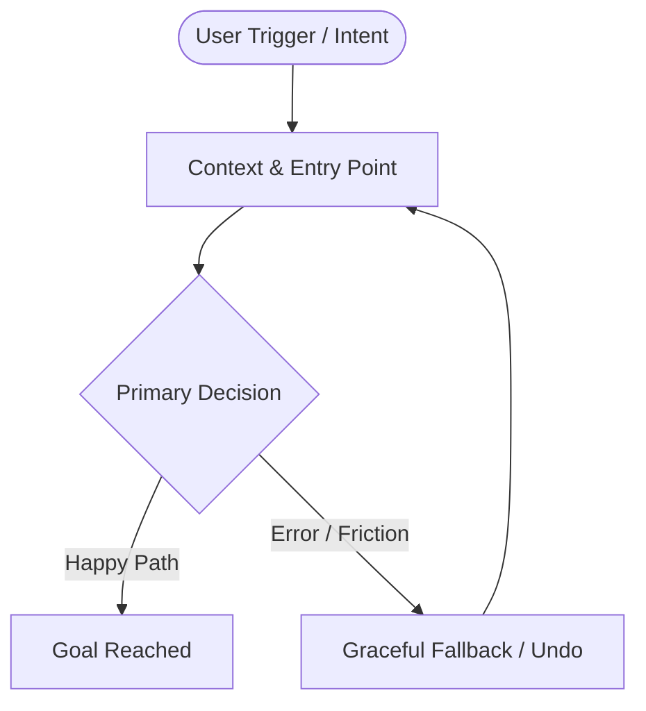

# User Journey & Flow Engineering

## 1. Journey Mapping Template
When mapping a feature journey, generate the following structured blueprint:

## 2. The 6-State Component Protocol
Never deliver a component or view without defining all 6 standard states:
1. **Empty State**: Friendly illustration/icon, clear explanation, high-visibility CTA to take initial action.
2. **Loading / Skeleton State**: Match the exact geometry of incoming content to prevent layout shifts (CLS = 0).
3. **Partial / Incomplete State**: Progress indicators, inline validation with helpful feedback.
4. **Ideal State**: High-density, pristine visual balance with crisp hierarchy.
5. **Error State**: Non-punitive language, explicit explanation of why it happened, inline remediation or single-click retry.
6. **Destructive State**: Two-step confirmations, contextual warnings, friction calibrated to data sensitivity.

## 3. Cognitive Load & UX Laws Checklist
- [ ] **Jakob's Law**: Does this layout follow recognizable mental models for the user’s domain?
- [ ] **Fitts's Law**: Are primary action targets large enough (minimum 44x44px touch targets) and positioned near natural cursor resting paths?
- [ ] **Hick's Law**: Are choices grouped or progressively disclosed to reduce decision latency?
- [ ] **Miller's Law**: Are long forms or data arrays chunked into 4-7 digestible semantic units?
