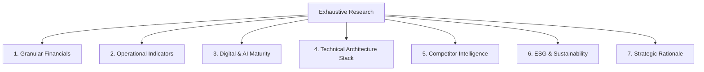

# Deep-Dive Corporate & AI Strategic Research Playbook

This skill governs how the agent conducts exhaustive, high-fidelity corporate and strategic research. It provides step-by-step instructions to find, ingest, organize, and analyze raw financial statements, operational records, and tech-stack details, and convert them into structured investment proposals and business cases.

---

## 1. Multi-Dimensional Data Harvesting Requirements

To build a high-fidelity business case or partnership proposal, the research must retrieve and extract granular, unsummarized data across the following seven domains:



### A. Financial Statements & Disclosures (Minimum 3-Year History + YTD)
Do not rely on high-level summaries. Retrieve the following specific line items from Balance Sheets, Income Statements, and Cash Flow Statements:
*   **Revenue Metrics**: Total revenue, organic growth rate, segment revenues, and divisional margins.
*   **Operating Expense (OpEx) Breakdown**: Cost of Goods Sold (COGS), SG&A (Sales, General & Administrative) expenses, and R&D expenditures.
*   **Profitability Metrics**: Gross profit, EBITDA, adjusted EBIT (excluding metal/commodity price effects), and net income.
*   **Capital Allocation**: Capital Expenditures (CapEx), return on capital employed (ROCE), net debt-to-equity ratio, and dividend payouts.
*   **Efficiency Initiatives**: Target annualized savings from active restructuring plans, headcount reductions, and process optimization programs.

### B. Operational & Manufacturing Indicators
*   **Production Capacity**: Output volumes, asset utilization rates, plant counts, and specialized equipment lines (e.g., Tube mills, press lines, Steckel mills).
*   **Yield & Loss Performance**: Scrap rates, rework percentages, baseline Overall Equipment Effectiveness (OEE) scores, and yield-loss bottlenecks (e.g., scrap percentages at specific production flows).
*   **Lead Times & Supply Chain**: Production lead times, work-in-progress (WIP) tracking accuracy, inventory turnover, and inbound supplier quality (incoming defect rates).

### C. Digital & AI Maturity Assessment
*   **Tool Adoptions**: Specific numbers of active users and query volumes for generic AI tools (e.g., Microsoft Copilot, ChatGPT Enterprise) and custom solutions (e.g., *Allemind*, *R&D Guru*).
*   **AI Stage Classification**: Categorize applications into:
    *   *Chatbots (Stage 1)*: Conversational retrieval systems.
    *   *Reasoners (Stage 2)*: Logical solvers mapping R&D libraries and historical metallurgical logs.
    *   *Agents (Stage 3)*: Autonomous systems executing workflows (such as scheduling solvers or anomaly alerts) with human oversight.
    *   *Self-Improving (Stage 4)*: Adaptive loops that optimize process parameters continuously.
*   **Skill Development**: Dedicated training programs, AI champion models, and cross-functional CoEs (Centers of Enablement).

### D. Technical Architecture Stack (OT-to-Cloud Lineage)
*   **Layer A1 (OT / Physical)**: Sensor types (vibration, temperature, pressure), PLC vendors, and SCADA setups.
*   **Layer A2 (Edge Integration)**: Edge gateways, OPC UA/MQTT brokers, and Unified Namespace (UNS) payloads.
*   **Layer A3 (Plant Systems)**: Local Manufacturing Execution Systems (MES), Laboratory Information Management Systems (LIMS), and Computerized Maintenance Management Systems (CMMS / Maximo).
*   **Layer A4 (Data Backbone)**: Data platform backends (Microsoft Fabric, Databricks, Snowflake Lakehouses) and schema enforcement rules.
*   **Layer A5 (Intelligence & ML)**: Model registries, MLOps orchestration tools (MLflow), and predictive pipelines.
*   **Layers A7–A9 (UI, Copilots, Governance)**: Power BI cockpits, Copilot Studio, and Purview data contracts.

### E. Competitor Intelligence & Market Benchmarking
*   **Competitor Actions**: Patent filings, R&D investments, product lines, and digital initiatives of direct peers (e.g., Nippon Steel, Tubacex, Salzgitter, Jiuli, Haynes, Aperam).
*   **Operational Benchmarks**: WEF Global Lighthouse Network metrics for conversion cost, lead times, energy utilization, and sales win rates.

### F. ESG & Sustainability Targets
*   **Energy Optimization**: Heat treatment thermal efficiency, compressed air energy leakages, and energy consumption per production unit.
*   **Carbon Audits**: Scope 1, 2, and 3 emissions metrics, circular water recycling rates, and compliance with European Sustainability Reporting Standards (ESRS).

---

## 2. Advanced Retrieval & Search Tactics

To bypass shallow landing pages, utilize the following precise search protocols:

### A. Advanced Search Operator Configurations
Use advanced search syntax to target source files directly:
*   *SEC Filings & Reports*: `site:sec.gov "Company Name" "annual report" filetype:pdf` or `site:company-investor-relations-domain "interim report" Q1 2026 filetype:pdf`
*   *Technical Architectures*: `"Microsoft Fabric" "HighByte" "Alleima" OR "Sandvik" filetype:pdf`
*   *Patent Searches*: `site:patents.google.com "industrial AI" OR "metallurgy defect prediction"`

### B. Targeting Key Sources
1.  **Corporate Newsrooms**: Search for quarterly financial presentations, Capital Markets Day slide decks, and transcripts of earnings calls.
2.  **Episerver / Optimizely CMS Scraping Protocol**: Many European industrial sites (e.g., Alleima, Sandvik) return HTTP 500 errors for direct `/globalassets/` search matches. To retrieve reports successfully:
    *   First fetch the parent index pages (e.g., `/investors/reports-and-presentations/interim-reports/` or `/annual-reports/`).
    *   Locate the active relative links under `/siteassets/documents/ir/` structures instead of `/globalassets/`.
3.  **Trade & Industry Journals**: Search for engineering case studies in specialized metallurgy, mining, or automated manufacturing publications.
4.  **Local Workspace Parsing**: Always verify if the raw PDF files are stored in `data/`. If present, convert them using `pdftotext` to ensure full structural accessibility.

---

## 3. Document Ingestion Pipeline

When integrating new raw data into the workspace, follow this strict pipeline:

```text
[Web Search / PDF Download]
         │
         ▼
[Save raw PDF to data/ folder]
         │
         ▼
[Convert: pdftotext data/file.pdf data/file.txt]
         │
         ▼
[Parse: Extract exact figures, quotes, and schemas]
         │
         ▼
[Integrate: Update OKF Concepts with absolute relative links]
         │
         ▼
[Validate: Run python3 .agents/skills/okf/scripts/validate.py]
```

*Note: All scratch `.txt` files in `data/` must be ignored by git via `.gitignore` to keep commits focused solely on conformant OKF files.*

---

## 4. High-Fidelity Business Case Scoping Models

When synthesizing business cases, avoid generic statements. Apply the following quantitative models:

### A. Operational Value Realization Benchmarks
| Value Lever | GLN Target Benchmark Range | Rationale / Drivers |
| :--- | :--- | :--- |
| **Conversion Cost** | 8% to 15% reduction | Predictive maintenance scheduling, automation of quality testing. |
| **Scrap & Rework** | 20% to 40% reduction | Inline prediction models, closed-loop defect isolation. |
| **OEE Improvement** | 10 to 30 percentage points | Asset status transparency, optimized changeover schedules. |
| **Energy Utilization** | 20% to 50% reduction | AI-driven thermal optimization, furnace gas scheduling. |
| **Sales Win Rate** | 10% to 20% increase | AI-assisted pricing guidance, rapid quotation configuration. |

### B. Financial Calculations
*   **Total Year 1 EBITDA Benefit** = `(Current Annual Conversion Cost * Conversion Cost % Savings) + (Annual Scrap Cost * Scrap % Savings) + (EBITDA Pricing Uplift % * Current Revenue)`
*   **Simple Payback (Months)** = `(Total Implementation Investment / Annual EBITDA Benefit) * 12`
*   **Net Present Value (NPV)** = `Sum( Net Cash Flows_t / (1 + r)^t ) - Initial Investment` (where `r` is the discount rate and `t` is the year).

---

## 5. Citations & Lineage Verification

Every piece of corporate intelligence must maintain trace links back to its origin.
*   **Concept Citation**: All files in the OKF bundle must declare their sources in the `# Citations` block at the bottom of the page, linking to the raw file in `data/` and providing the exact page or slide number if known.
*   **Git Verification**: Commit all updates with a clear message specifying the source and change scope.
